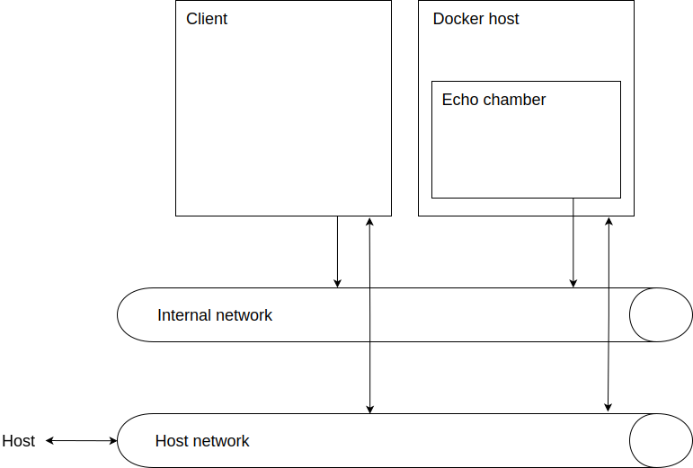

# Introduction


# Goals
* Creating a repeatable linux install without any human intervention
* Running a docker container with total control over an ethernet device

# Software needed on the host machine

* A bash shell
* Virtualbox
* Docker -- well, not really see "A Windows note aside"
* 7zip

# The setup



To keep the setup easy and straight forward we are going to create two virtual machiens which are not connected to the internet and both have two network connections. One, the host network, over which we can manage the machines from our host machine and another, the internal network, which is the network neccesary for our experiment.

## Creating the client machine

Firstly we are going to create the run off the mill linux client machine, the steps we'll be going through are: Creating the install media, create the hardware, putting it together.

### Create a linux image

As it turns out setting up a preseed enviroment is really easy but all the tools are as user friendly as you'd expect from a debian tooling. I want to get cracking with the networking first so I'm just going to grab a ready to go Ubuntu image.

1. To get a decent image I've downloaded the Ubuntu server image from: [link](https://www.osboxes.org/ubuntu-server/#ubuntu-server-1804-vbox)
    
    ```
    Information attached to the image:
    Username: osboxes
    Password: osboxes.org
    Root Account Password: osboxes.org
    VB Guest Additions & VMware Tools: Not Installed
    Keyboard Layout: US (Qwerty)
    VMware Compatibility: Version 10+
    ```

2. Using windows the file will located in the ```~/Downloads``` directory and we can pick it up there and extract a copy of the hard-disk image to the client-vm and docker-vm directory.

    ```
    $ 7z e -bd -bt -o./client-vm/ ~/Downloads/1804-264.7z '64bit/Ubuntu Server 18.04.2 (64bit).vdi' && mv ./client-vm/'Ubuntu Server 18.04.2 (64bit).vdi' ./client-vm/ubuntu-server-18.04.2.vdi
    $ 7z e -bd -bt -o./docker-vm/ ~/Downloads/1804-264.7z '64bit/Ubuntu Server 18.04.2 (64bit).vdi' && mv ./docker-vm/'Ubuntu Server 18.04.2 (64bit).vdi' ./docker-vm/ubuntu-server-18.04.2.vdi
    ```

Using these images we will create the virtual machines and in a later revision this will be replaced by a preseeder.

### Creating the machine

```bash
#
# First we are going to create and install the client VM because it is a 
# straight up linux machine without any bells and whistles.
#
$ VBoxManage createvm \
    --name client \
    --ostype linux_64 \
    --basefolder $( realpath ./client-vm/ ) \
    --register \
    --default 

#
# On my machine this did print outsome errors although it didn't seem to 
# impeed the creation and registration of the machine.
#
# $ VBoxManage createvm --name client --ostype linux --basefolder ./client-vm/ --default --register
# VBoxManage.exe: error: The machine is not mutable (state is PoweredOff)
# VBoxManage.exe: error: Details: code VBOX_E_INVALID_VM_STATE (0x80bb0002), component MachineWrap, interface IMachine, callee IUnknown
# VBoxManage.exe: error: Context: "ApplyDefaults(bstrDefaultFlags.raw())" at line 290 of file VBoxManageMisc.cpp
# 

# Removing the entire machine can be done using;
$ VBoxManage unregistervm --delete client 

# 
# Attach our harddisk, first we need to attach a controller and then add 
# we're going to add the image we downloaded in the previous section. 
#
$ VBoxManage storagectl client \
    --name client-disk-controller \
    --add sata \
    --portcount 2 \
    --bootable on

$ VBoxManage storageattach client \
    --storagectl client-disk-controller \
    --port 0 \
    --type hdd \
    --medium $( realpath ./client-vm/ubuntu-server-18.04.2.vdi )

#
# Configuring the network hardware
#

# Before we start configuring the networking hardware we need to make sure 
# there is a host only network available for VBox. The following will list 
# all available host-only network interfaces
$ VBoxManage list hostonlyifs

# If this list is empty a host network can be created by running
$ VBoxManage hostonlyif create 

# It also seems that the default host only network doesn't have a DHCP
# server set up out of the box. When running virtual machines in this
# network it does help to set this up, figuring out the IP and using that
# to connect to the machine.
#
# Adding a DHCP server to the default host-only network
$ VBoxManage hostonlyif ipconfig "VirtualBox Host-Only Ethernet Adapter" --dhcp

# Assuming the default host network here, YMMV.
$ VBoxManage modifyvm client \
    --nic1 hostonly \
    --hostonlyadapter1 "VirtualBox Host-Only Ethernet Adapter" \
    --nic2 intnet \
    --intnet2 "internal-network"

# On a second note; because the images from osbox are pretty bare bone we will 
# need some internet connection to install all the applications we need. 
# (openssh, telnet, vim etc) and for none specific reason either Ubuntu, the 
# virtual machine or a combination of both prefer the outgoing connection to be
# on the first NIC.
$ VBoxManage modifyvm client \
    --nic1 nat \
    --nic2 hostonly \
    --hostonlyadapter2 "VirtualBox Host-Only Ethernet Adapter" \
    --nic3 intnet \
    --intnet3 "internal-network"

# The VBox documentation seems to suggest that new internal networks are 
# configured and created as needed. When we are going to run all the machines 
# we'll add a DHCP server to the "internal-network" so that the client machine 
# will automatically get a IP number assigned. For now though we'll just fix 
# the IP address of the client to 
```

#### A Windows note aside
Now that we have the hardware configured and ready to go I ran in to a specific windows issue, starting the virtual machine using the VirtualBox Manager threw the following error:
```
Failed to open a session for the virtual machine client.

Raw-mode is unavailable courtesy of Hyper-V. (VERR_SUPDRV_NO_RAW_MODE_HYPER_V_ROOT).

Result Code: E_FAIL (0x80004005)
Component: ConsoleWrap
Interface: IConsole {872da645-4a9b-1727-bee2-5585105b9eed}
```

A quick search lead me to the following stackoverflow post "[virtualbox Raw-mode is unavailable courtesy of Hyper-V windows 10](https://stackoverflow.com/questions/50053255/virtualbox-raw-mode-is-unavailable-courtesy-of-hyper-v-windows-10)". And this thread on the virual box forum [link](https://forums.virtualbox.org/viewtopic.php?f=6&t=87237). Summarizing the common thread seems to be to disable a option called "hypervisorlaunchtype".

```bash
# In a privileged shell run, and reboot
$ bcdedit //set hypervisorlaunchtype off

# Validate the setting by running
$ bcdedit

# To enable the setting (you'd expect on...)
$ bcdedit //set hypervisorlaunchtype auto
```

There seems to be a significant downside to this though; which is that docker desktop will fail to start using the default configuration. Even for this there seem to but multiple solutions;

1. Ignore this situation because we can do our experiment and then re-enable it
2. Run the docker deamon somewhere else, although it doesn't seem possible to configure docker desktop using it's gui the commandline tooling seems perfectly happy to do this [[1](https://medium.com/@peorth/using-docker-with-virtualbox-and-windows-10-b351e7a34adc)]
3. Write a version of this experiment using Hyper-V

### Installing linux and configuring the client machine

```bash
# When first booting up a fresh osboxes-box are kind of outdated and Ubuntu has
# a deamon which automagically installs updates, this is fine but it does take
# while to complete all the updates. Monitor the progress and sudo yourself and
# track the progress by running;
$ tail -f /var/log/apt/history.log
```

```bash
# After all the installs have been done make sure to get a root shell (ignore 
# all nasty configuration for now) and we can install all the stuff we need and
# configure the network devices.
$ apt-get install openssh-server 

# Setting up the openssh deamon
$ systemctl enable ssh && system start ssh

#
# Configuring the network devices using netplan, the osboxes look like they
# have some pre applied magic although it looks safe to just overwrite the 
# netplan configurtaion with this
#
$ tee /etc/netplan/50-cloud-init.yaml <<EOF
network:
    ethernets:
        enp0s3:
            dhcp4: true
        enp0s8:
            dhcp4: true
        enp0s9:
            addresses: [192.168.1.1/24]
    version: 2
EOF

$ netplan apply

# Use `ip a` to figure out the ip for our host network (enp0s8) and ssh in to it from your host
```

## Creating the docker host

1. Download the osboxes image of debian [here](https://sourceforge.net/projects/osboxes/files/v/vb/14-D-b/9.7/9764.7z/download). 
    ```
    Username: osboxes
    Password: osboxes.org
    Root Account Password: osboxes.org
    VB Guest Additions & VMware Tools: Installed
    Keyboard Layout: US (Qwerty)
    VMware Compatibility: Version 10+
    ```

2. Then unpack it to the docker-vm directory and name it something nice
    ```bash
    $ 7z e -bd -bt -o./docker-vm/ ~/Downloads/9764.7z '64bit/Debian 9.7 (64bit).vdi' && mv ./docker-vm/Debian\ 9.7\ \(64bit\).vdi ./docker-vm/debian-9.7.vdi
    ```

```bash
#
# Creating the docker host will follow the client creation roughly as it is simply a 
# linux machine as well.
#
$ VBoxManage createvm \
    --name docker \
    --ostype linux_64 \
    --basefolder $( realpath ./docker-vm/ ) \
    --register \
    --default 

$ VBoxManage storagectl docker \
    --name docker-disk-controller \
    --add sata \
    --portcount 2 \
    --bootable on

# Ended up just installing debian 10, getting a ready to go image is to much of
# a hassle.
$ VBoxManage storageattach docker \
    --storagectl docker-disk-controller \
    --port 0 \
    --type hdd \
    --medium $( realpath ./docker-vm/debian-9.7.vdi )

$ VBoxManage modifyvm docker \
    --nic1 nat \
    --nic2 hostonly \
    --hostonlyadapter2 "VirtualBox Host-Only Ethernet Adapter" \

# I've been having some weird crashes and it didn't really seem to work all the
# time. I've found some documentation that seem to take care of this;
# https://github.com/jpetazzo/pipework#virtualbox
$ VBoxManage modifyvm docker \
    --nic3 intnet \
    --nictype3 Am79C973 \
    --nicpromisc3 allow-all \
    --intnet3 "internal-network"
```

### Installing linux and configuring the docker machine

After doing some research on how to configure a promiscues network interface using netplan it turned out that it wasn't easily possible. Although it seems that ip can be used to configure most of this it seems like a hack not aiding in the maintainability of the system and violating "least suprises"-rule. To figure out if would be a viable solutiuon I've gone for debian on this machine.

The least hackish solution I could find was "(setting up networkd-dispatcher)[https://askubuntu.com/a/1037955/279346]".

For now we are going with the debian image for this machine and use the accompinaing network tooling to configure this machine. 

```bash
#
# Unfortunatly this box comes with a window system so we'll just deal with 
# that, using the known credential get to a terminal.
#
$ su - # to get a root shell

# Make everything up to date
$ apt-get update && apt-get upgrade

# Install openssh-server so we can copy and paste the commands from the
# docker documentation
$ apt-get install openssh-server
$ service ssh start

# How to install docker is directly lifted from the docker documentation. For
# now we're going with the straight forward install using the docker registry.
# https://docs.docker.com/install/linux/docker-ce/debian/
$ apt-get install \
    apt-transport-https \
    ca-certificates \
    curl \
    gnupg2 \
    software-properties-common

$ curl -fsSL https://download.docker.com/linux/debian/gpg | apt-key add -

$ add-apt-repository \
   "deb [arch=amd64] https://download.docker.com/linux/debian \
   $(lsb_release -cs) \
   stable"

$ apt-get update && apt-get install docker-ce docker-ce-cli containerd.io

# Run the hello world verification
$ docker run hello-world

# We also need docker compose, the easiest way to install it would be to use
# the docker compose container. (see the notes under "Alternative Install Options")
# Source: https://docs.docker.com/compose/install/
$ su -c "curl -L --fail https://github.com/docker/compose/releases/download/1.24.1/run.sh -o /usr/local/bin/docker-compose"
$ su -c "chmod +x /usr/local/bin/docker-compose"

# Now run docker compose to validate to pull in the images and validate the install
$ docker-compose --help

# Making sure the debian user can run the docker contianers
$ usermod -a -G docker debian

#
# Configure the NICs, it apppears that with the image the NAT and the host only
# NICs are already configured out of the box as they both use DHCP which seems
# to be pretty standard. NIC3 (enp0s9) has to be configured in promiscues mode.
#

# The non persistent way to get this working would be (in a root shell) the
# down side here obviously is that you'd need to do this every time the NIC
# cycles.
$ ip link set enp0s9 promisc on

# Persistently setting promiscuous on a device
$ tee /etc/network/interfaces.d/enp0s9 <<EOF
auto enp0s9
iface enp0s9 inet manual
        up ip link set \$IFACE promisc on
EOF

$ tee /etc/network/interfaces.d/br0 <<EOF
auto br0
iface br0 inet manual
    bridge_ports enp0s9
EOF

# Now reboot your machine for the changes to take effect, runing `ip a` should
# list enp0s9 in PROMISC mode.
```

## Creating the echo-chamber

```bash
# We're going to start by giving the default user permissions to work with 
# docker so we won't run in to weird permission sitautations later on.
$ su -pc "usermod -a -G docker $USER"

# Reset your environment by logging out and logging in again for the changes
# to take effect.

# We're going to create a quick yaml file which contains everything we need to
# initialize and run our echo server
$ tee echo-server.yml <<EOF

version: '3.7'

services:
    echo-server:
        image: alpine:latest
        entrypoint: nc -lk -l -u -p 1337 -e /bin/cat
        restart: always
        networks:
            echo-network:
                ipv4_address: 192.168.1.2

networks:
    echo-network:
        name: echo-network
        driver: macvlan
        driver_opts:
            parent: br0
        ipam:
            config:
                - subnet: 192.168.1.0/24        

EOF
```

# Validation
With all the machines running we are going to log in to our client machine and then bounce some data off the docker container.

```bash
$ ssh user@client

client $ echo 'Bounce!' >( telnet echo-chamber )

# We expect to get 'Bounce!' back
```

# License
The work contained in this repository is licensed [CC BY-SA 4.0](https://creativecommons.org/licenses/by-sa/4.0/).

# Sources and references

* [Diagram(s) drawn using](http://draw.io/)
* [Documentation about the VirtualBox commandline](https://www.virtualbox.org/manual/)
* [Ubuntu 16.04 Desktop unattended installation(http://gyk.lt/ubuntu-16-04-desktop-unattended-installation/)
* [Virtualbox: Creation and controlling virtual maschines from commandline](https://michlstechblog.info/blog/virtualbox-creating-and-controling-virtual-maschines-from-command-line/)

Some useful resources about configuring network devices in debian:
* https://unix.stackexchange.com/questions/128439/good-detailed-explanation-of-etc-network-interfaces-syntax
* 